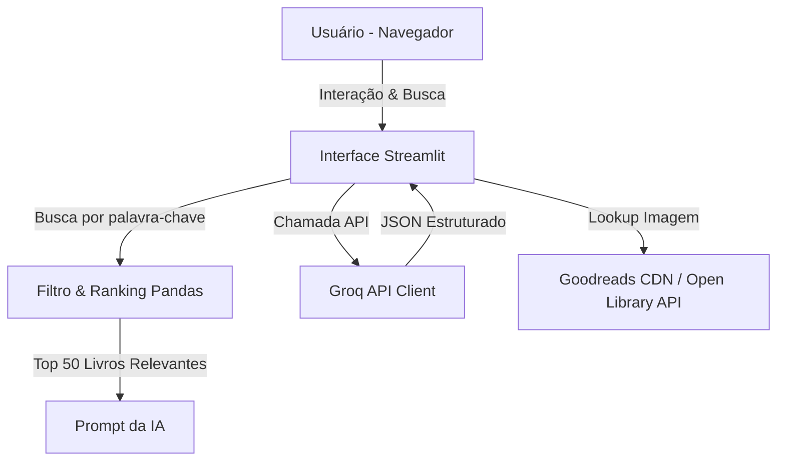

# Documentação Técnica: Leia.ai 🧠💻

Esta documentação descreve a arquitetura interna, a engenharia de dados, os fluxos de integração com a Inteligência Artificial e as decisões de design da aplicação **Leia.ai**.

---

## 1. Arquitetura Geral do Sistema

A aplicação segue uma arquitetura de camada única voltada para execução local de alta velocidade, dividindo-se logicamente nos seguintes componentes:



* **Frontend (Apresentação)**: Construído com Streamlit, utilizando injeção de HTML e estilos CSS customizados para criar um visual premium baseado em Glassmorphism.
* **Processamento de Dados (Filtro e Busca)**: Controlado via biblioteca **Pandas**, operando localmente sobre o dataset do catálogo.
* **Agente de IA (Modelagem)**: Integração via biblioteca **OpenAI SDK** direcionada para os endpoints da API do **Groq** usando o modelo Llama 3.3.

---

## 2. Camada de Dados e Algoritmo de Ranking

### Carregamento de Dados (`carregar_dados`)
O catálogo é carregado em memória a partir do arquivo `archive/books.csv` e passa por um processo de cache nativo do Streamlit (`@st.cache_data`). Isso evita leituras de disco repetitivas a cada interação do usuário.
As colunas selecionadas e sanitizadas são: `title`, `authors`, `original_publication_year`, `average_rating`, `language_code`, `image_url`, `isbn`, `isbn13`.

### Filtro e Algoritmo de Ranking por Palavra-Chave
Para garantir que a IA priorize livros que de fato constam no acervo físico local (catálogo), implementamos um ranqueador por palavras-chave na caixa de busca do usuário:
1. **Limpeza**: Remove caracteres especiais e divide a query em tokens (palavras).
2. **Stopwords**: Filtra palavras comuns em português (ex: "quero", "livros", "sobre").
3. **Pesagem**:
   * Uma correspondência no **título** do livro soma **+3** pontos.
   * Uma correspondência no **autor** do livro soma **+1** ponto.
4. **Ordenação**: O DataFrame é ordenado primeiramente pelo `match_score` (pontuação) e secundariamente pela nota média (`average_rating`). Os primeiros 50 resultados são enviados no contexto da IA.

---

## 3. Integração com LLM (Groq API)

A aplicação utiliza o SDK oficial da OpenAI apontando para a base URL da Groq:
* **Endpoint**: `https://api.groq.com/openai/v1`
* **Modelo**: `llama-3.3-70b-versatile` (otimizado para alto desempenho e resposta estruturada).
* **Parâmetro de Resposta**: `response_format={"type": "json_object"}`, forçando o modelo a retornar estritamente um JSON estruturado.

### Prompt do Sistema & JSON Schema
O modelo atua com a persona de **Leia**, uma assistente de leitura carismática. A estrutura do JSON de retorno requerida é:

```json
{
  "introducao": "Frase carismática de introdução.",
  "livros": [
    {
      "titulo": "Título do Livro",
      "autor": "Autor do Livro",
      "nota": 4.5,
      "idioma": "Português",
      "genero": "Gênero",
      "icone": "📚",
      "origem": "catálogo | conhecimento geral",
      "motivo": "Por que este livro combina com a pesquisa.",
      "isbn": "ISBN-13 ou ISBN-10"
    }
  ],
  "conclusao": "Frase de encerramento."
}
```

---

## 4. Engenharia de Imagens e Capas de Livros

Para resolver o desafio de carregar capas de livros reais sem onerar o carregamento do servidor e manter uma estética agradável, foi projetada uma pipeline híbrida com fallback em cascata:

```
[Iniciar busca de capa]
       │
       ▼
1. Verificar no catálogo local
       ├─ Tem image_url válido (não-nophoto)? ──► [Exibir Capa Goodreads]
       └─ Não tem ou é nophoto? 
              │
              ▼
2. Existe ISBN no registro local ou retornado da IA?
       ├─ Sim ──► [Exibir Capa via Open Library (covers.openlibrary.org)]
       └─ Não 
              │
              ▼
3. Fallback: Gerar Gradiente dinâmico via Hash MD5 do Título (Lilás/Roxo)
```

### Fallback Avançado no Cliente (Navegador)
Para evitar links quebrados em tela (ex: se o Open Library não possuir a capa de um ISBN específico), o HTML injetado utiliza o evento JavaScript `onerror` na tag ``:
```html
<div class="cover">
    
    <div class="fallback-gradient"></div>
</div>
```
Se a imagem falhar ao carregar no cliente, o navegador a oculta instantaneamente (`display: none`), exibindo o gradiente abstrato que está renderizado exatamente abaixo dela.

---

## 5. Interface e Injeção de Design System (CSS)

A folha de estilo injetada através do `st.markdown(..., unsafe_allow_html=True)` aplica as seguintes regras essenciais:

### Glassmorphism & Visual Premium
* **Cards**: Borda fina semi-transparente (`border: 1px solid rgba(255,255,255,.12)`) e fundo escuro levemente transparente (`background: rgba(255,255,255,.065)`).
* **Hover Animations**: Transição suave de escala na capa do livro (`transform: scale(1.04)`) e efeito de elevação no card ao passar o mouse.

### Estado e Interatividade (`st.session_state`)
Os chips de atalho e o histórico recente utilizam o estado de sessão do Streamlit.
* Ao clicar em um botão de histórico ou chip, a variável `st.session_state.query_val` é atualizada.
* O comando `st.rerun()` é chamado para forçar o Streamlit a redesenhar a tela com o novo valor preenchido na área de texto.

### Resolução de Tremor de Tela
Para evitar que a barra de rolagem lateral crie um loop de cálculo de largura infinita no Streamlit (gerando o tremor visual na imagem de logo), aplicamos:
* `overflow-x: hidden !important` global no HTML, body e containers principais.
* Redimensionamento nativo do Streamlit utilizando colunas dinâmicas em vez de largura fixa CSS (`st.columns([1, 8, 1])`).
